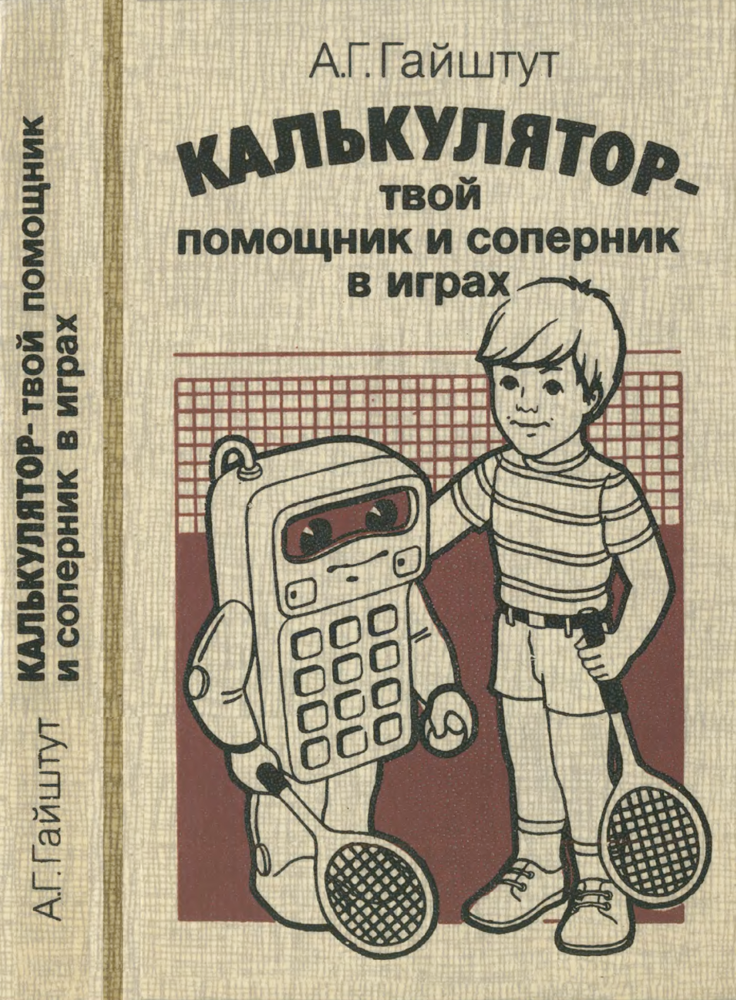

# bz34

Эмулятор калькулятора БЗ-34. Пока ничего не умеет кроме самой простой арифметики.

## Списко комманд

На просторах интернета можно найти несколько древних выпусков ["Наука и жизнь"](/docs/nauka_i_zizn_1984_12.djv) и ["Квант"](/docs/kvant55.djvu)
в которых будет написано как работать с БЗ-34. В этих журналах прекрасные таблички со списком команд:

И конечно же шедевр советской тех литературы для школьников: ["Калькулятор - твой помощник и соперник в играх"](/docs/book-bz34.djv)

## Литература

* [Архив Кванта](http://publ.lib.ru/ARCHIVES/B/''Bibliotechka_''Kvant''/_''Bibliotechka_''Kvant''.html)
* [Архив НЖ](https://pynop.com/nauka-i-zhizn.htm)
* [Система комманд ЭКВМ](http://mk.semico.ru/tabl2.htm)
* [Система комманд БЗ-34](http://mk.semico.ru/comb334.htm)

# Как писать игрушечные виртуальные машины

* [Write your Own Virtual Machine](https://justinmeiners.github.io/lc3-vm/)
